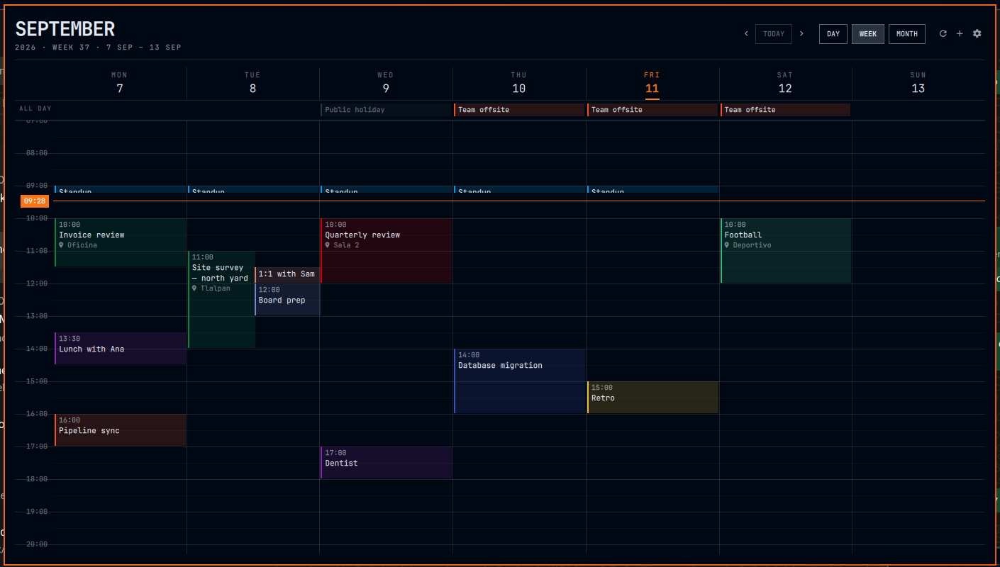

# Omagoocal — Google Calendar for Omarchy

Your Google Calendar in the Omarchy bar: day, week and month views, multiple
accounts, event creation and editing, colour straight from Google, and a
notification before events start. Opens instantly — the last sync is painted
from disk before the first network request is made.



## Sign-in without a Google Cloud project

Google requires an OAuth client to reach the Calendar API, and there is no
anonymous path for read/write access. This plugin does not ship one and does
not ask you to create one. Instead it uses **GNOME Online Accounts** — the
same stack GNOME Calendar uses — which carries the distribution's own Google
client.

That means:

- No Google Cloud project, no API keys, no client ID to paste.
- No Google verification review, and none of the 100-test-user cap an
  unverified OAuth client lives under.
- Token refresh, secure storage and the account list are GOA's job, not this
  plugin's. Nothing here ever writes a refresh token to disk.

Sign-in opens GOA's window, which shows Google's own consent screen.

## Install

```bash
omarchy plugin add https://github.com/huligabuliga/Omagoocal.git --enable
```

Open the panel and press **Sign in with Google**. If GNOME Online Accounts
is missing, the panel offers an **Install dependencies** button first, which
runs the install in a visible Omarchy terminal:

```
gnome-online-accounts
gnome-online-accounts-gtk
```

The backend (`omagoocal`) ships inside the plugin, so a clone is all you
need. Symlink it onto your `PATH` if you want it as a CLI too.

### Dependencies

Everything comes from the Arch repositories; nothing is fetched at runtime
except your calendar data from Google.

| Package | Why |
|---|---|
| `gnome-online-accounts`, `gnome-online-accounts-gtk` | Google sign-in and token refresh. Installed on demand from the panel. |
| `python` | The backend is stdlib-only Python 3 — no `pip`, no `python-gobject`. |
| `systemd` (`busctl`) | Talks to GNOME Online Accounts over D-Bus. |
| `libnotify` (`notify-send`) | Event notifications. Already part of Omarchy. |

The plugin writes only to its own state folder, `~/.local/state/omagoocal/`,
which it checks is a real directory it owns, mode `0700`, before every read
or write; files are replaced atomically through random exclusive temp files
and never through a symlink. It never edits your Hyprland, shell, or theme
configuration; enabling it in the bar goes through `omarchy plugin enable`,
which is your action.

Because the backend holds a Google access token while it runs, nothing on
that path is resolved through `PATH`: it runs under `/usr/bin/python3` and
calls `/usr/bin/busctl`, `/usr/bin/notify-send`, `/usr/bin/xdg-open`,
`/usr/bin/pacman` and Omarchy's own installer under `/usr/share/omarchy/bin`
by absolute path. Every API response is capped at 8 MiB and every paginated
listing at 20 pages / 5000 items.

Calendar content is treated as untrusted: anyone who shares a calendar with
you chooses the text in it. Every event field is rendered as plain text
(never parsed as markup), notification text is escaped and passed after
`--`, only `https://` links are ever handed to `xdg-open`, and event ids are
URL-quoted before they touch a request path.

## Remove

```bash
omarchy plugin remove io.github.huligabuliga.omagoocal
rm -rf ~/.local/state/omagoocal        # preferences and caches
```

Your Google account stays in GNOME Online Accounts (it is not the plugin's to
delete); remove it there if you no longer want it. If you installed the GOA
packages only for this plugin, uninstall `gnome-online-accounts-gtk` and
`gnome-online-accounts` with your package manager.

## Using it

| Where | Action |
|---|---|
| Bar label | Next event and how long you have. It takes that event's colour in the last 15 minutes before it starts. |
| Bar left click | Open the calendar |
| Bar right click | Refresh, bypassing every cache |
| Bar middle click | New event |
| Grid click | New event at that time, rounded to the half hour |
| Event click | Edit |
| Event middle click | Open in Google Calendar |
| `+N more` | Too many events to show side by side — opens the day view |

Keys while the panel is open: `D` `W` `M` switch view, `T` today, `N` new
event, `R` refresh, `,` settings, `[` `]` step, arrows step, `Esc` close.
In the editor, `Ctrl+Enter` saves and `Esc` cancels.

IPC, for keybindings:

```bash
omarchy-shell omagoocal toggle
omarchy-shell omagoocal newEvent
omarchy-shell omagoocal refresh
```

## Settings

Reachable from the gear, or `,`. Connected accounts (add and remove), which
calendars to show, notification lead time, opening view, week start, 12/24
hour clock, the hour the grid opens on, and refresh interval.

Preferences live in `~/.local/state/omagoocal/config.json`, alongside a
one-hour cache of calendar lists and the last sync result. Delete the folder
to reset everything; accounts themselves live in GNOME Online Accounts.

## Themes

The panel takes every colour from the active Omarchy theme and adapts to light
ones as well as dark: Omarchy ships five light themes, and a 16% wash of an
event colour that reads well on `vantablack` disappears entirely on `white`.
Chip washes, the spine width, and the faded-past-event opacity are all chosen
from the surface luminance. Verified on `futurenergy`, `catppuccin-latte`,
`white` and `vantablack`.

## Notes

- **Colour** is Google's own: an event's colour when it has one, otherwise its
  calendar's.
- **Recurring events** are expanded by the API, and editing one edits that
  occurrence, not the series.
- **Deleting asks first.** Everything else is reversible from Google Calendar;
  a delete from here is not.
- **All-day events** are edited in inclusive days — a one-day event starts and
  ends on the same date, even though Google stores the end exclusively.
- **Notifications** go through `notify-send`. If you have Do Not Disturb on,
  you will not see them.
- **Refresh is polling**, not push: Google's watch channels need a public
  callback URL, which a laptop does not have. Events are fetched fresh every
  time; the calendar list and Google's colour palette are cached for an hour.
  The refresh button and `R` skip that cache.
- **Nothing is truncated.** Every paginated API response is followed to its
  last page, so a shared calendar with hundreds of jobs a month shows all of
  them.

## Development

```bash
node test_model.js      # date, layout, overflow and notification logic
python3 test_backend.py # GOA account discovery and API request shaping
```

`omagoocal` is stdlib-only Python and talks to GOA over `busctl`, so there
is no `pip` dependency and no `python-gobject`.

## License

MIT
